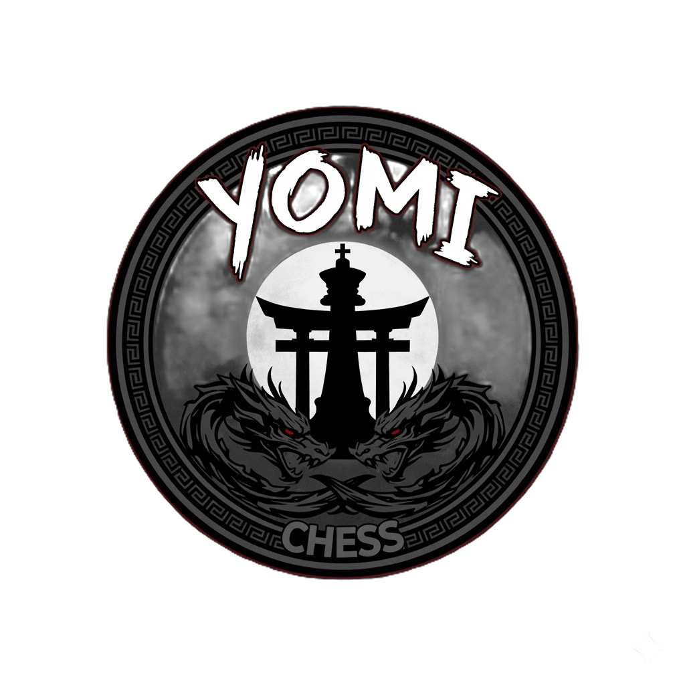

# YomiChess - Manual del Usuario

Bienvenido a **YomiChess**, un juego de ajedrez con variantes increíbles. Sigue esta guía para instalar, configurar y disfrutar de las partidas.

---

## **Instrucciones de Instalación**

1. Descarga el contenido dentro de la carpeta `Builds`.
2. Localiza el archivo `YomiChess.exe`.
3. Ejecuta `YomiChess.exe` en tu sistema.
   - ⚠ **Nota Importante:** Windows podría intentar evitar la ejecución del programa mostrando advertencias sobre seguridad. Esto ocurre porque el programa no cuenta con una firma digital segura, pero puedes continuar de manera segura con la ejecución.

---

## **Conexión a través de Internet**

Si deseas jugar con alguien fuera de tu red local, será necesario configurar los puertos en tu router:
- Abre los puertos necesarios para permitir la conexión.
- Consulta la documentación del fabricante de tu router para hacerlo correctamente.

---

## **Cómo Jugar**

1. Abre el juego y selecciona `Jugar` en el menú principal.
2. Escoge la variante del juego:
   - **Clásico:** Disfruta del ajedrez tradicional.
   - **Chess Kune Do:** Una nueva variante única de YomiChess.
3. Al ingresar al tablero:
   - Uno de los jugadores debe hacer clic en **Host** para crear la sala.
   - El otro jugador debe pulsar **Join** para conectarse automáticamente al host.

---

## **Soporte**

Si tienes dudas o encuentras problemas, no dudes en abrir un *issue* en este repositorio.

¡Gracias por jugar YomiChess! Que disfrutes de la experiencia.
